# Cafe Order Project

온라인 카페 주문 관리 시스템 - 웹과 모바일 앱을 통해 카페 메뉴를 주문하고 관리할 수 있는 크로스플랫폼 서비스입니다.


## 목차

- [주요 기능](#주요-기능)
  - [사용자 기능](#사용자-기능)
  - [주문 상태 관리](#주문-상태-관리)
- [기술 스택](#기술-스택)
  - [웹 (Web)](#웹-web)
  - [모바일 (Mobile)](#모바일-mobile)
  - [공통](#공통)
- [프로젝트 구조](#프로젝트-구조)
- [Firestore 데이터베이스 구조](#firestore-데이터베이스-구조)
  - [Collections](#collections)
- [설치 방법](#설치-방법)
  - [사전 요구사항](#사전-요구사항)
  - [웹 애플리케이션 설치](#웹-애플리케이션-설치)
  - [모바일 애플리케이션 설치](#모바일-애플리케이션-설치)
- [Firebase 설정](#firebase-설정)
- [실행 방법](#실행-방법)
  - [웹 개발 서버 실행](#웹-개발-서버-실행)
  - [웹 프로덕션 빌드](#웹-프로덕션-빌드)
  - [모바일 앱 실행](#모바일-앱-실행)
- [주요 특징](#주요-특징)
- [스크린샷](#스크린샷)
- [개발 팀](#개발-팀)
- [라이선스](#라이선스)
- [문제 해결](#문제-해결)
- [향후 계획](#향후-계획)
- [기여하기](#기여하기)

---

## 주요 기능

### 사용자 기능
- Google 소셜 로그인 및 이메일 회원가입/로그인
- 카테고리별 메뉴 조회 (커피, 음료, 베이커리)
- 장바구니 관리 (실시간 웹-모바일 동기화)
- 주문 생성 및 특수 요청사항 입력
- 주문 내역 조회 및 상태 추적
- 추천 메뉴 및 이벤트 배너

### 주문 상태 관리
- `pending` - 대기 중
- `confirmed` - 확인됨
- `preparing` - 준비 중
- `ready` - 준비 완료
- `completed` - 완료
- `cancelled` - 취소됨

## 기술 스택

### 웹 (Web)
- **프레임워크**: React 18.3.1 + TypeScript
- **상태 관리**: Zustand 4.5.0
- **라우팅**: React Router DOM 6.24.0
- **스타일링**: Tailwind CSS 3.4.3
- **빌드 도구**: Vite 5.2.0
- **백엔드**: Firebase 11.10.0 (Auth, Firestore)
- **HTTP 클라이언트**: Axios 1.7.0

### 모바일 (Mobile)
- **프레임워크**: Flutter 3.10.4 / Dart
- **상태 관리**: Provider 6.1.2
- **백엔드**: Firebase (firebase_core, firebase_auth, cloud_firestore)
- **인증**: Google Sign-In 6.2.1
- **이미지 캐싱**: cached_network_image 3.3.1

### 공통
- **인증**: Firebase Authentication
- **데이터베이스**: Cloud Firestore
- **호스팅**: Firebase Hosting (Web)

## 프로젝트 구조

```
Cafe_Order_Project/
├── web/                          # React 웹 애플리케이션
│   ├── src/
│   │   ├── pages/               # 페이지 컴포넌트
│   │   │   ├── MainPage.tsx     # 홈 화면
│   │   │   ├── LoginPage.tsx    # 로그인
│   │   │   ├── MenuPage.tsx     # 메뉴 목록
│   │   │   ├── CartPage.tsx     # 장바구니
│   │   │   ├── OrderPage.tsx    # 주문 확인
│   │   │   ├── OrderCompletePage.tsx  # 주문 완료
│   │   │   └── OrderHistoryPage.tsx   # 주문 내역
│   │   ├── services/            # Firebase API 서비스
│   │   │   ├── firebase.ts      # Firebase 초기화
│   │   │   ├── authService.ts   # 인증 서비스
│   │   │   ├── menuService.ts   # 메뉴 서비스
│   │   │   ├── cartService.ts   # 장바구니 서비스
│   │   │   └── orderService.ts  # 주문 서비스
│   │   ├── hooks/               # React Hooks
│   │   │   └── useAuth.tsx      # 인증 상태 관리
│   │   ├── store/               # Zustand 상태 관리
│   │   │   └── useStore.ts      # 전역 상태
│   │   ├── components/          # 재사용 컴포넌트
│   │   ├── types/               # TypeScript 타입 정의
│   │   └── App.tsx              # 메인 앱 컴포넌트
│   ├── package.json
│   ├── vite.config.ts
│   └── tailwind.config.js
│
├── mobile/                       # Flutter 모바일 앱
│   ├── lib/
│   │   ├── screens/             # 화면 위젯
│   │   │   ├── login_screen.dart      # 로그인 화면
│   │   │   ├── main_screen.dart       # 메인 (TabBar)
│   │   │   ├── home_screen.dart       # 홈 화면
│   │   │   ├── order_screen.dart      # 주문 화면
│   │   │   ├── cart_screen.dart       # 장바구니 화면
│   │   │   └── orders_screen.dart     # 주문 내역 화면
│   │   ├── services/            # 서비스 계층
│   │   │   └── auth_service.dart      # 인증 서비스
│   │   ├── providers/           # Provider 상태 관리
│   │   │   └── cart_provider.dart     # 장바구니 Provider
│   │   ├── models/              # 데이터 모델
│   │   │   ├── menu_item.dart         # 메뉴 아이템
│   │   │   ├── order_model.dart       # 주문 모델
│   │   │   └── cart_item.dart         # 장바구니 아이템
│   │   ├── firebase_options.dart # Firebase 설정
│   │   └── main.dart            # Entry Point
│   └── pubspec.yaml
│
└── images/                       # 공유 이미지 리소스
```

## Firestore 데이터베이스 구조

### Collections

#### menus
```json
{
  "id": "auto-generated",
  "name": "아메리카노",
  "description": "깔끔한 에스프레소",
  "price": 4500,
  "category": "coffee",
  "imageUrl": "https://...",
  "isAvailable": true,
  "createdAt": "Timestamp"
}
```

#### carts
```json
{
  "userId": "user-uid",
  "items": [
    {
      "menuItem": { /* MenuItem 객체 */ },
      "quantity": 2
    }
  ],
  "updatedAt": "Timestamp"
}
```

#### orders
```json
{
  "id": "auto-generated",
  "userId": "user-uid",
  "items": [
    {
      "menuItem": { /* MenuItem 객체 */ },
      "quantity": 2
    }
  ],
  "totalPrice": 9000,
  "status": "pending",
  "request": "얼음 적게 주세요",
  "createdAt": "Timestamp",
  "updatedAt": "Timestamp"
}
```

## 설치 방법

### 사전 요구사항
- Node.js 18+ (웹)
- Flutter SDK 3.10.4+ (모바일)
- Firebase 프로젝트 설정

### 웹 애플리케이션 설치

```bash
cd web
npm install
```

### 모바일 애플리케이션 설치

```bash
cd mobile
flutter pub get
```

## Firebase 설정

### 1. Firebase 프로젝트 생성
1. [Firebase Console](https://console.firebase.google.com/)에서 새 프로젝트 생성
2. Authentication 활성화 (Google 로그인 설정)
3. Firestore Database 생성 (테스트 모드로 시작)

### 2. 웹 앱 설정
1. Firebase 프로젝트에서 웹 앱 추가
2. Firebase SDK 구성 정보를 `web/src/services/firebase.ts`에 추가:

```typescript
const firebaseConfig = {
  apiKey: "YOUR_API_KEY",
  authDomain: "YOUR_PROJECT_ID.firebaseapp.com",
  projectId: "YOUR_PROJECT_ID",
  storageBucket: "YOUR_PROJECT_ID.firebasestorage.app",
  messagingSenderId: "YOUR_SENDER_ID",
  appId: "YOUR_APP_ID"
};
```

### 3. 모바일 앱 설정
1. Firebase 프로젝트에서 Android/iOS 앱 추가
2. `google-services.json` (Android) 파일을 `mobile/android/app/`에 추가
3. `GoogleService-Info.plist` (iOS) 파일을 `mobile/ios/Runner/`에 추가
4. Firebase CLI로 설정:

```bash
cd mobile
flutterfire configure
```

## 실행 방법

### 웹 개발 서버 실행

```bash
cd web
npm run dev
```

브라우저에서 `http://localhost:5173` 접속

### 웹 프로덕션 빌드

```bash
cd web
npm run build
npm run preview
```

### 모바일 앱 실행
#### Chrome (웹 브라우저)에서 실행

```bash
# mobile 폴더에서
cd mobile

# Flutter 실행
flutter run

# 기기 선택 프롬프트에서 Chrome 선택
[2]: Chrome (chrome)
```
### 린트 및 타입 체크 (웹)

```bash
cd web
npm run lint
npm run type-check
```

## 주요 특징

### 실시간 동기화
- 웹과 모바일 간 장바구니 실시간 동기화
- Firestore의 `onSnapshot`을 활용한 실시간 데이터 구독
- 주문 상태 변경 시 즉시 반영

### 크로스플랫폼 일관성
- 동일한 Firebase 백엔드 사용
- 통일된 데이터 구조 및 API
- 플랫폼별 최적화된 UI/UX

### 보안
- Firebase Authentication을 통한 사용자 인증
- 사용자별 데이터 격리 (userId 기반)
- Google OAuth 2.0 소셜 로그인

### UI/UX
- 반응형 디자인 (다양한 화면 크기 지원)
- Material Design 3 (모바일)
- Tailwind CSS 기반 모던한 디자인 (웹)
- 부드러운 애니메이션 및 트랜지션

## 스크린샷
### 웹 애플리케이션

| 메인 페이지 | 로그인 화면 | 메뉴 목록 |
|:---:|:---:|:---:|
| 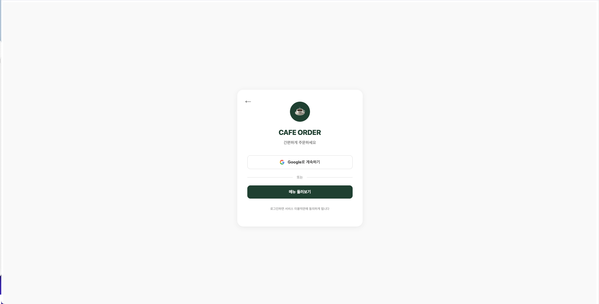 | 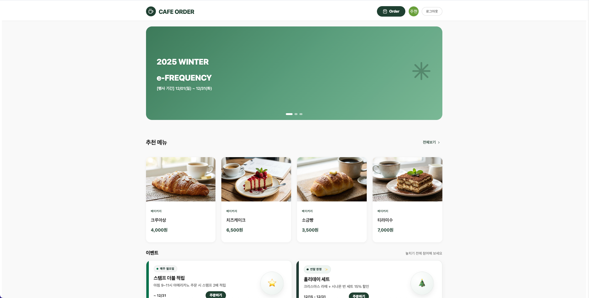 | 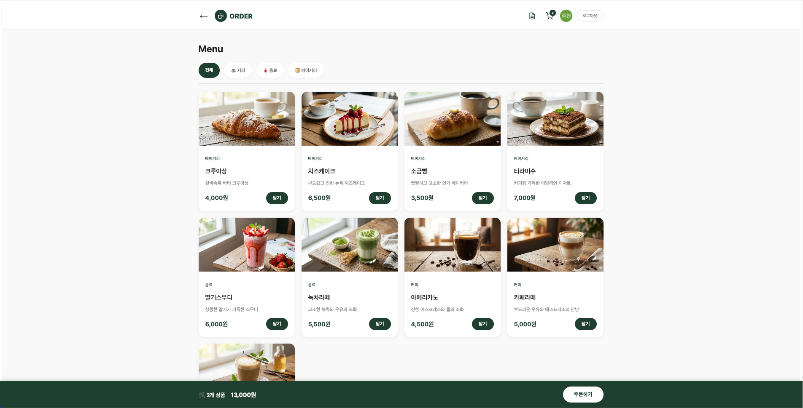 |
| 홈 화면의 배너와 추천 메뉴 | Google 로그인 및 회원가입 | 카테고리별 메뉴 조회 |

| 장바구니 | 주문 확인 | 주문 완료 |
|:---:|:---:|:---:|
| 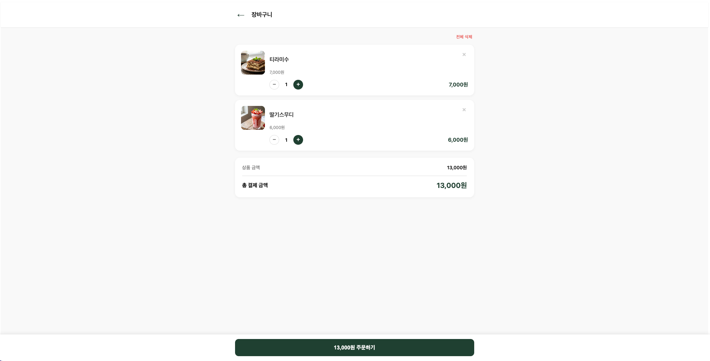 | 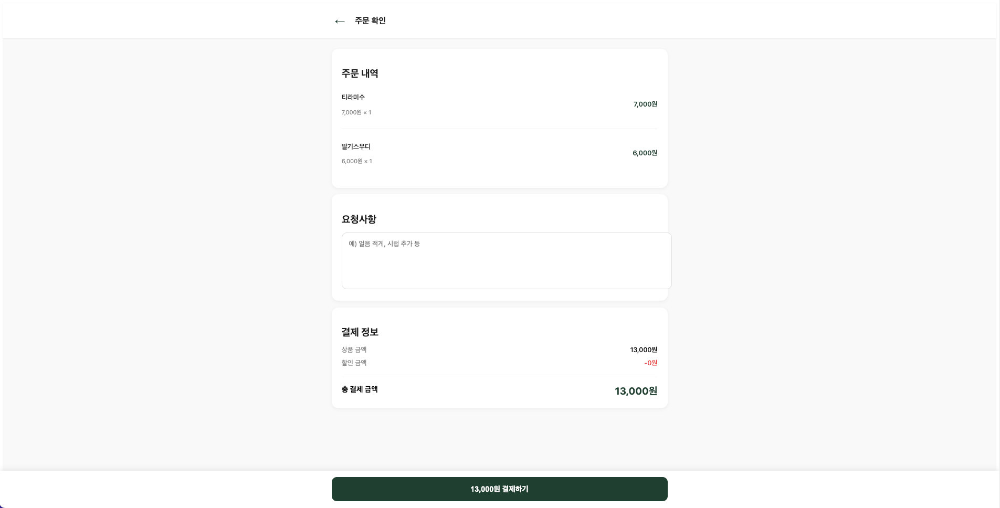 | 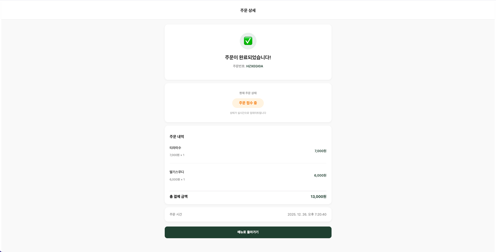 |
| 실시간 동기화 장바구니 | 주문 상세 및 요청사항 | 주문 완료 안내 |

| 주문 내역 |
|:---:|
| 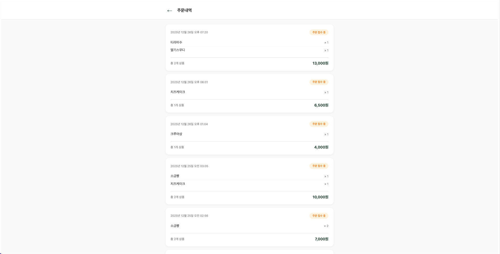 |
| 주문 상태 추적 및 히스토리 |

### 모바일 애플리케이션

| 로그인 | 홈 화면 | 메뉴 |
|:---:|:---:|:---:|
| 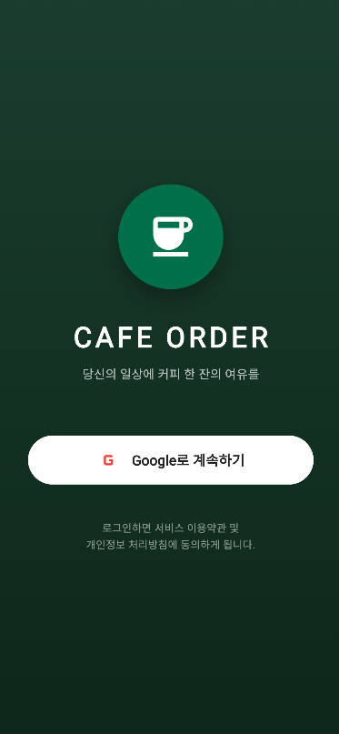 | 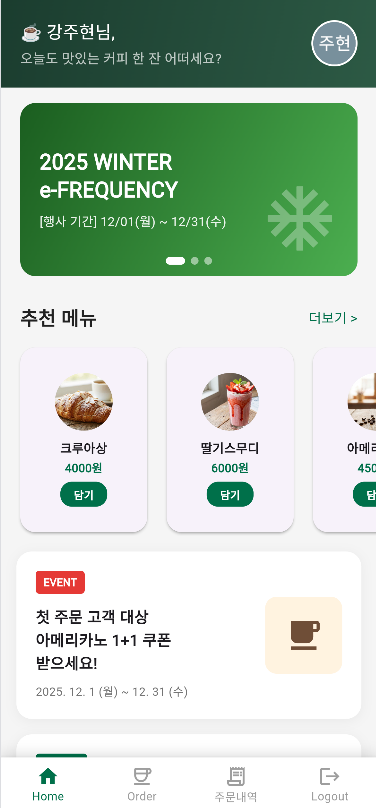 | 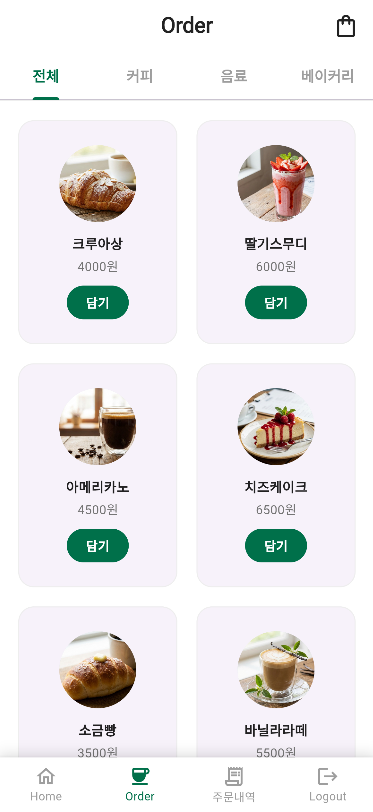 |
| Google 로그인 | 메인 화면 | 메뉴 목록 |

| 장바구니 | 주문 확인 | 주문 내역 |
|:---:|:---:|:---:|
| 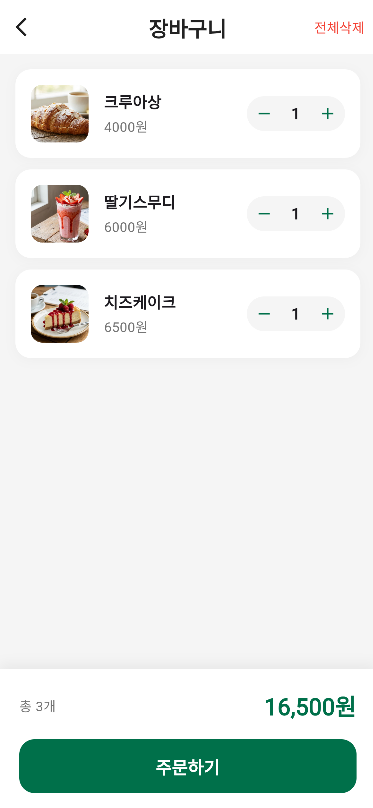 | 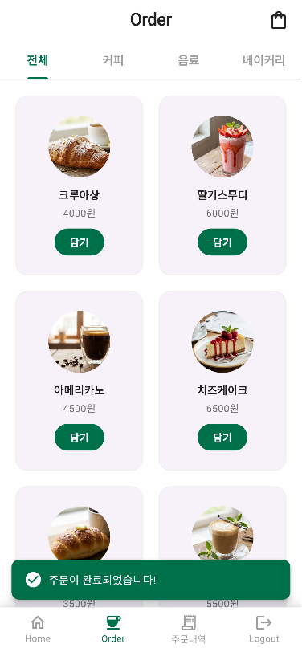 | 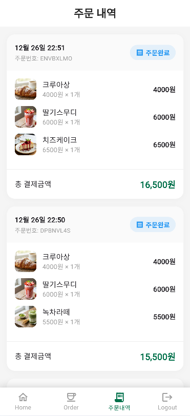 |
| 장바구니 관리 | 주문하기 | 주문 상태 확인 |


## 개발 팀

- Team: Cafe-Order(강주현,최서원)
- Repository: [Cafe_Order_Project](https://github.com/Cafe-Order/Cafe_Order_Project)

## 문제 해결

### 웹 빌드 오류
- `node_modules` 삭제 후 `npm install` 재실행
- Node.js 버전 확인 (18 이상 권장)

### 모바일 빌드 오류
- `flutter clean` 후 `flutter pub get` 재실행
- Flutter SDK 버전 확인: `flutter doctor`

### Firebase 연결 오류
- Firebase 구성 파일 확인
- Firebase 프로젝트 설정 확인
- 인증 및 Firestore 규칙 확인

## 향후 계획

- [ ] 관리자 대시보드 추가
- [ ] 결제 시스템 통합
- [ ] 푸시 알림 기능
- [ ] 스탬프 적립 시스템 완성
- [ ] 다국어 지원
- [ ] 다크 모드 지원

## 기여하기

1. Fork the repository
2. Create your feature branch (`git checkout -b feature/AmazingFeature`)
3. Commit your changes (`git commit -m 'Add some AmazingFeature'`)
4. Push to the branch (`git push origin feature/AmazingFeature`)
5. Open a Pull Request

—
Cafe-Order Team : 강주현, 최서원
